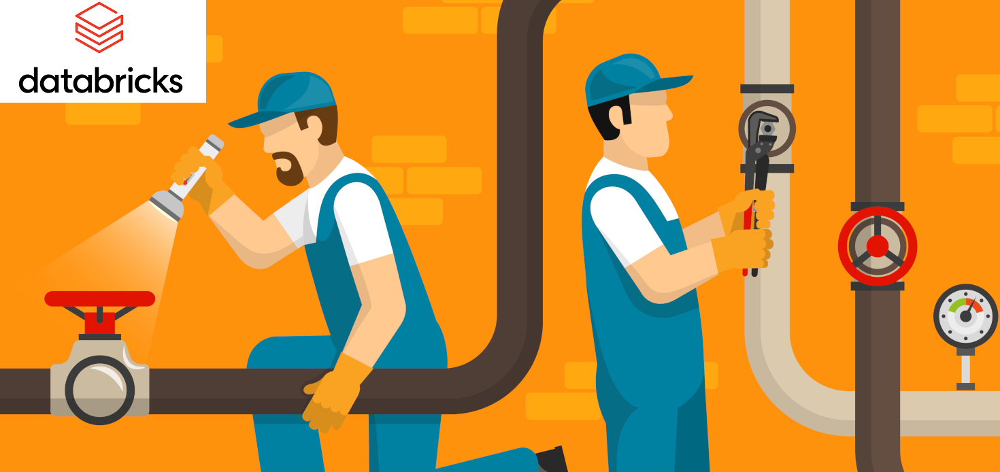

# Machine learning pipeline that runs on Databricks platform

This ML pipeline is intended to run in aSpark environment. It was tested onteh Databricks communty open source platform.

## 1. Background
A large manufacturing company data flow is getting more important by the day. The company has tested some Python code on local machines to treat data but now there is the need to automatize and scale up the ML pipeline. Databricks would provide a very efficient solution but before transitioning to this platform the company would like to have a demo of this technology using a simple free data set: the Titanic survival data.

## 2. The data
A csv file has been  sourced from https://www.kaggle.com/c/titanic/data and imported into Databricks.

The ETL pipeline is broken into three steps that correspond to different quality levels in the pipeline:  
    • data ingestion (“Bronze” tables). Set the correct schema.
    • data cleaning, augmenting (“Silver” tables)
    • transformation/feature engineering to make it ready for ML/AI (“Gold” tables)
      Having separated tables allows having checkpoints, helping later modifications of the code

## 3. Conclusions 
Databricks provides and intuitive and powerful ETL platform. 
